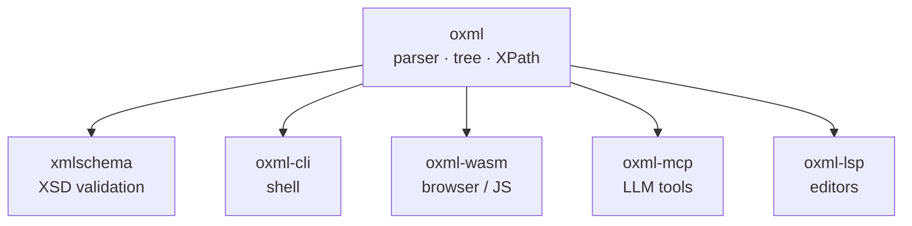

<!-- SPDX-License-Identifier: Apache-2.0 OR MIT -->

# The oxml ecosystem

Six crates, one version number. What each is for, and which one you
want.

## Contents

- [Which crate do I want?](#which-crate-do-i-want)
- [The crates](#the-crates)
- [How they fit together](#how-they-fit-together)
- [One version across six crates](#one-version-across-six-crates)

## Which crate do I want?

| I want to… | Use |
|---|---|
| Parse and query XML from Rust | `oxml` |
| Validate XML against an XSD schema | `xmlschema` |
| Run an XPath query from a shell or a script | `oxml-cli` |
| Parse XML in a browser or a JS runtime | `oxml-wasm` |
| Give an LLM the ability to query XML documents | `oxml-mcp` |
| Get diagnostics and completion in an editor | `oxml-lsp` |

## The crates

### `oxml` — the library

The parser, the tree, and XPath 1.0. Everything else in this list
depends on it. `no_std` with `alloc`, no `unsafe`, no runtime
dependencies beyond an optional `libm`.

Read its [README](../README.md) first; the rest of this document
assumes it.

### `xmlschema` — XSD validation

Validates a parsed document against an XML Schema. Separate from `oxml`
because most consumers of an XML parser never validate, and a schema
engine is a large amount of code to compile for nothing.

Early. Check its own README for what is implemented before depending on
it.

### `oxml-cli` — the command line

XPath queries and well-formedness checks from a shell.

```bash
oxml query '//book[@lang="en"]/title' catalogue.xml
oxml check catalogue.xml
```

Useful in a pipeline, in CI, and for the thing an XML library is most
often needed for: finding out what is actually in a file.

### `oxml-wasm` — WebAssembly bindings

`oxml` compiled to WebAssembly, with a JavaScript API. Because the
crate is `no_std`-capable and has no C dependencies, the module is
small and has no build toolchain requirements beyond `wasm-pack`.

### `oxml-mcp` — Model Context Protocol server

Exposes parsing and XPath as MCP tools, so an LLM can query an XML
document rather than being handed the whole thing and asked to read it.

The natural use is large documents: an agent that can run
`count(//record)` does not need the document in its context window.

### `oxml-lsp` — Language Server Protocol server

Well-formedness diagnostics as you type, in any editor that speaks LSP.
Uses the same byte offsets and line/column reporting the library
exposes, which is why those are part of the public API rather than a
formatted string.

## How they fit together



Every arrow is a dependency on `oxml` and nothing else. The satellites
do not depend on each other, so adding one to a project costs the
library plus that satellite.

## One version across six crates

The suite ships a single version number, moving in steps of 0.0.1.
`oxml 0.0.4` works with `oxml-cli 0.0.4` and `xmlschema 0.0.4`, and no
other combination is supported.

This costs a release in crates that did not change. It buys a reader
never having to work out a compatibility matrix, which for a suite this
size is the better trade.

See [MSRV-AND-DEPRECATION.md](MSRV-AND-DEPRECATION.md).
