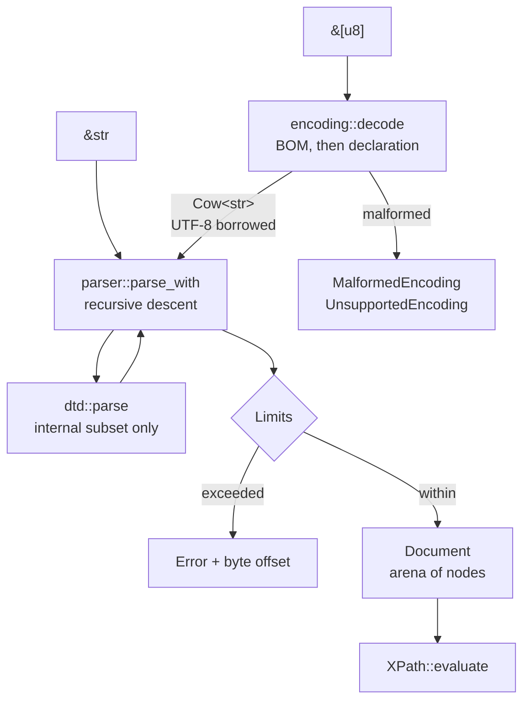
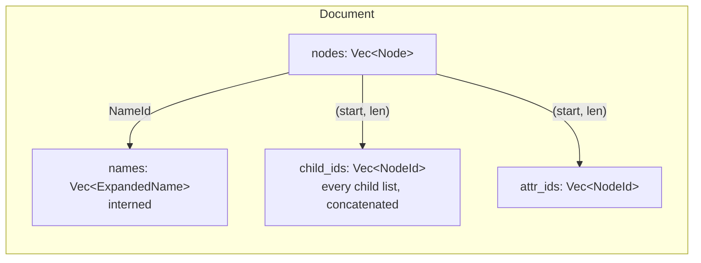
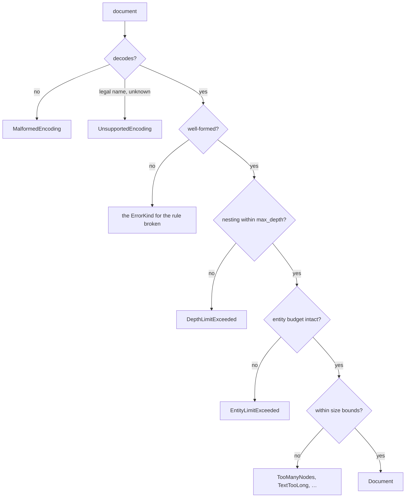

<!-- SPDX-License-Identifier: Apache-2.0 OR MIT -->

# Diagrams

Mermaid sources, kept in version control so they can be reviewed as
text.

## The parse pipeline

## The document arena

A `Node` stores ranges rather than owning a `Vec` each. That is the
difference between one allocation per node and one per node *plus* one
per child list.

## Where a document can be refused

